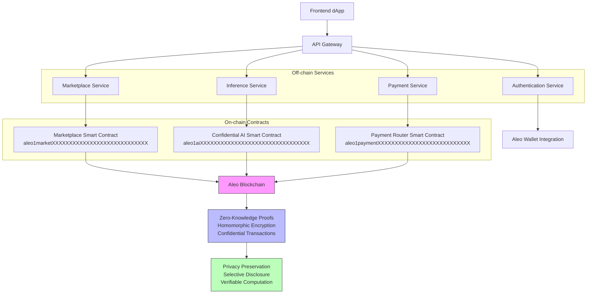

# Aleo Confidential AI Marketplace

A decentralized marketplace for confidential AI inference and data trading built on the Aleo blockchain.

## Table of Contents
- [Overview](#overview)
- [Architecture](#architecture)
- [Smart Contracts](#smart-contracts)
- [Workflow](#workflow)
- [Getting Started](#getting-started)
- [API Endpoints](#api-endpoints)
- [Frontend](#frontend)
- [Backend](#backend)
- [Contributing](#contributing)
- [License](#license)

## Overview
The Aleo Confidential AI Marketplace enables secure, private AI model inference and data exchange using zero-knowledge proofs. Users can:
- Register AI models and datasets as NFTs
- Execute confidential inferences without exposing inputs or model weights
- Trade AI services and data with verifiable privacy guarantees
- Settle payments using Aleo's confidential transactions

## Architecture


### Components
- **Frontend**: Next.js dApp with React components
- **Backend**: Node.js/Express API services
- **Smart Contracts**: Aleo programs written in Leo
- **Infrastructure**: Vercel (frontend), AWS/Azure (backend), Aleo Testnet/Mainnet

## Smart Contracts
Located in `/backend/contracts/`:

### 1. Profile Registry (`profile_registry`)
- Manages user profiles and identities
- Handles verification and reputation scores
- Stores encrypted metadata
- **Contract Address:** `aleo1profileXXXXXXXXXXXXXXXXXXXXXXXXXXXXX` (Testnet)

### 2. Data Market (`data_market`)
- Facilitates dataset listing and trading
- Implements access control via ZK proofs
- Manages royalties and licensing
- **Contract Address:** `aleo1marketXXXXXXXXXXXXXXXXXXXXXXXXXXXX` (Testnet)

### 3. Payment Router (`payment_router`)
- Handles confidential payments and settlements
- Supports escrow and multi-party payments
- Integrates with Aleo's Aleo Credit (ALE) token
- **Contract Address:** `aleo1paymentXXXXXXXXXXXXXXXXXXXXXXXXXXX` (Testnet)

### 4. Confidential AI Marketplace (`confidential_ai_marketplace`)
- Core inference execution logic
- Manages model encryption and secure computation
- Verifies proofs of correct execution
- **Contract Address:** `aleo1aiXXXXXXXXXXXXXXXXXXXXXXXXXXXXXXXX` (Testnet)

*Note: Replace with actual deployed addresses after deployment to Aleo Testnet/Mainnet.*

## Workflow
### User Registration
1. User connects Aleo wallet via dApp
2. Frontend calls `/api/v1/profile/register`
3. Backend creates profile and stores verification data
4. Profile Registry contract updates on-chain

### Model/Data Listing
1. Provider uploads model/dataset metadata
2. Backend encrypts sensitive parameters
3. Marketplace contract mints NFT representing asset
4. Listing appears in marketplace browse

### Confidential Inference
1. Consumer selects model and provides encrypted input
2. Inference service generates ZK proof of valid input
3. AI contract executes model on encrypted data
4. Contract returns encrypted output and verification proof
5. Consumer decrypts output with their key

### Payment Settlement
1. Consumer initiates payment via Payment Router
2. Funds held in escrow until proof verification
3. Upon successful verification, payment released to provider
4. All transactions confidential on Aleo blockchain

## Getting Started
### Prerequisites
- Node.js 18+
- Aleo SDK installed
- Git
- Vercel CLI (for frontend deployment)

### Installation
```bash
# Clone repository
git clone https://github.com/yourorg/aleo-ai-marketplace.git
cd aleo-ai-marketplace

# Install dependencies
npm install
cd frontend && npm install
cd ../backend && npm install

# Setup environment variables
cp .env.example .env
# Edit .env with your configuration

# Build contracts
cd backend/contracts && ./scripts/build-all.ps1
```

### Development
```bash
# Start backend services
cd backend && npm run dev

# Start frontend
cd frontend && npm run dev

# Run tests
npm test
```

## API Endpoints
### Authentication
- `POST /api/v1/register` - Register new user
- `POST /api/v1/profile/register` - Create user profile
- `GET /api/v1/profile/:id` - Fetch profile data

### Marketplace
- `GET /api/v1/marketplace/listings` - Browse assets
- `POST /api/v1/marketplace/listings` - Create new listing
- `GET /api/v1/marketplace/listings/:id` - Get listing details
- `PUT /api/v1/marketplace/listings/:id` - Update listing
- `DELETE /api/v1/marketplace/listings/:id` - Remove listing

### Inference
- `POST /api/v1/inference/execute` - Run confidential inference
- `POST /api/v1/inference/settle` - Settle inference payment
- `GET /api/v1/inference/:id` - Check inference status

### Payments
- `POST /api/v1/payment/intent` - Create payment intent
- `POST /api/v1/payment/settle` - Settle payment
- `GET /api/v1/payment/:id` - Get payment details

### Commitments
- `POST /api/v1/commitments` - Create new commitment
- `GET /api/v1/commitments/:id` - Fetch commitment
- `PUT /api/v1/commitments/:id` - Update commitment

## Frontend
Built with Next.js 13+ and React 18:
- `/frontend/src/app` - App router pages and components
- `/frontend/src/components` - Reusable UI components
- `/frontend/src/lib` - Utilities, hooks, and API client
- Wallet integration via Aleo Wallet Connect
- Responsive design for mobile and desktop

Key components:
- `AleoWalletProvider.tsx` - Wallet connection context
- `MarketplaceGrid.tsx` - Asset browsing interface
- `InferenceExecutor.tsx` - Confidential inference UI
- `ProfileManager.tsx` - User profile management

## Backend
Node.js microservices architecture:
- `/backend/api` - Express route handlers
- `/backend/services` - Business logic layer
- `/backend/utils` - Helper functions and integrations
- `/backend/contracts` - Smart contract interactions

Services:
- Authentication Service (JWT + Aleo verification)
- Marketplace Service (listing management)
- Inference Service (ZK proof generation/validation)
- Payment Service (Aleo transaction handling)
- Commitment Service (off-chain agreement tracking)

## Smart Contract Details
### Languages & Tools
- Leo (Aleo's private-by-design programming language)
- SnarkOS developer toolkit
- Aleo SDK for contract deployment and interaction

### Key Features
- Homomorphic encryption for secure computation
- Zero-knowledge proofs for verifiable privacy
- Confidential transfers hiding amounts and parties
- Programmable privacy controls via view keys

### Deployment
Contracts are deployed to:
- Aleo Testnet for development/staging
- Aleo Mainnet for production
- Deployment scripts in `/backend/contracts/scripts/`

## Contributing
1. Fork the repository
2. Create your feature branch (`git checkout -b feature/amazing-feature`)
3. Commit your changes (`git commit -m 'Add some amazing-feature'`)
4. Push to the branch (`git push origin feature/amazing-feature`)
5. Open a Pull Request

Please read [CONTRIBUTING.md](CONTRIBUTING.md) for details on our code of conduct and pull request process.

## License
This project is licensed under the MIT License - see the [LICENSE](LICENSE) file for details.

## Acknowledgments
- Aleo Team for the innovative blockchain platform
- OpenZeppelin for security patterns
- Project contributors and community testers